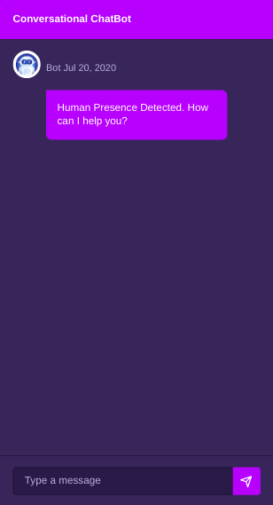
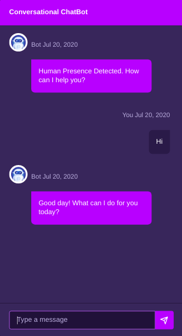
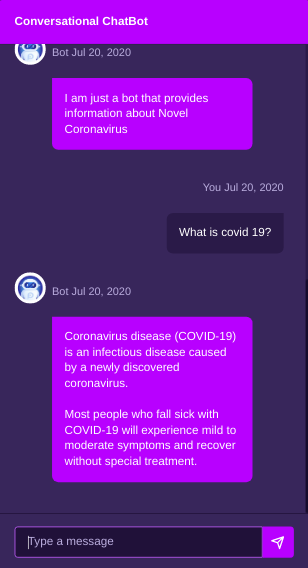

# Chatbot App
This chatbot application demonstrates how [google dialogflow](https://cloud.google.com/dialogflow) can be easily integrated into web applications. Firebase Cloud Functions are used to make request to the dialogflow API.

This project was generated with [Angular CLI](https://github.com/angular/angular-cli) version 9.0.1.

## Getting Started

* [Download the installer](https://nodejs.org/) for Node LTS.
* Install the Angular CLI globally: `npm install -g @angular/cli`
* Clone this repository: `git clone https://github.com/mdabdulraheem/chatbot-app.git`.
* Run `npm install` from the project root.
* Follow the instructions at [repo](https://github.com/mdabdulraheem/chatbot-cloud-functions) to setup cloud functions.
* Change the cloud functions url in the [chatbot.component.ts](https://github.com/mdabdulraheem/chatbot-app/blob/master/src/app/chatbot/chatbot.component.ts) to your GCP project url.
* Run `ng serve` in a terminal from the project root.

## Sample Images

